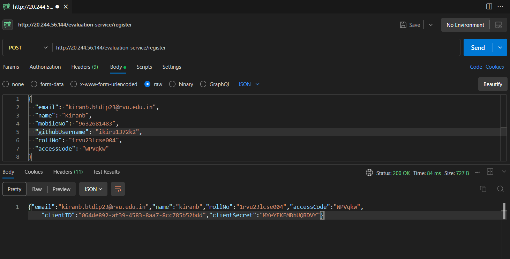
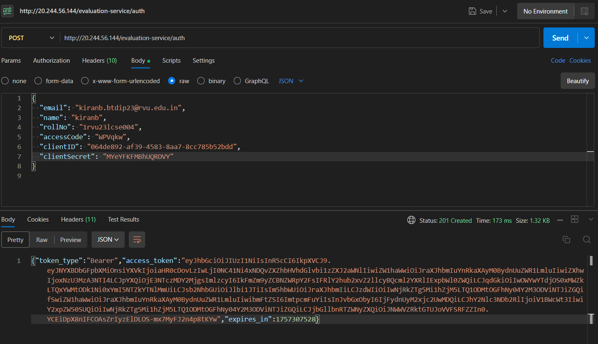
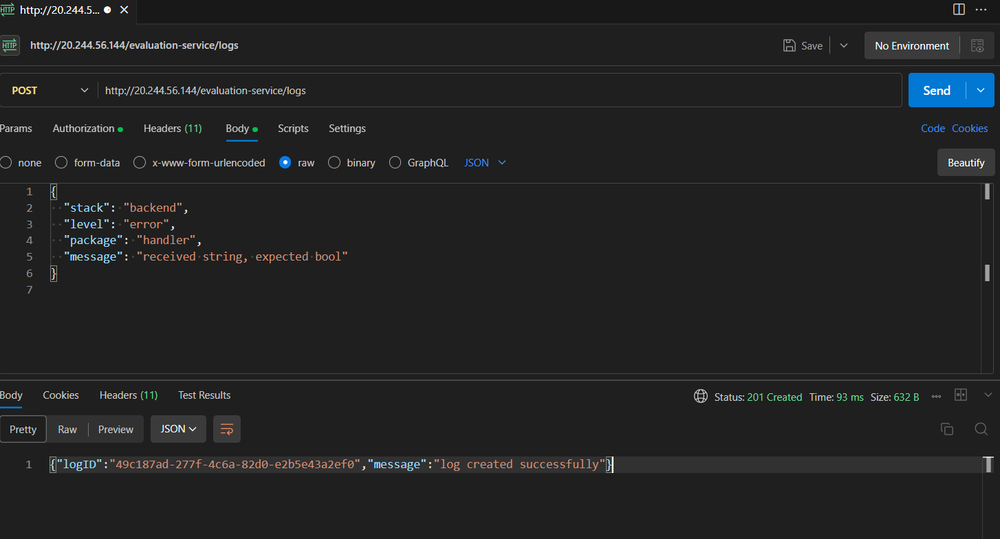
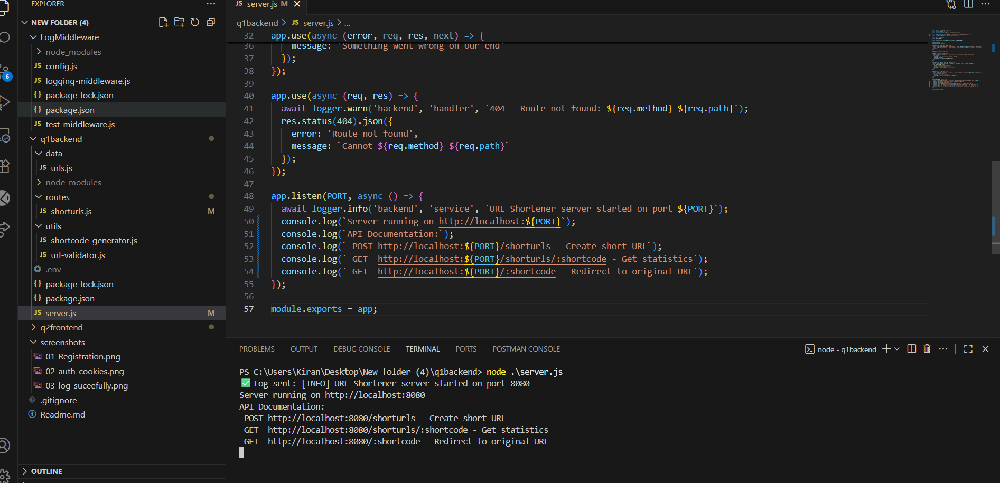
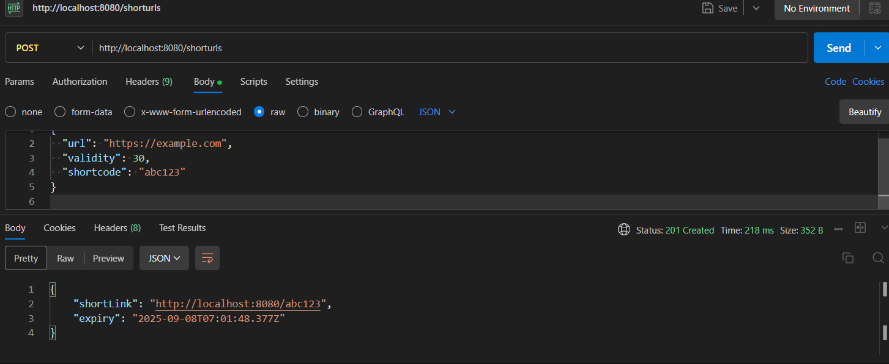
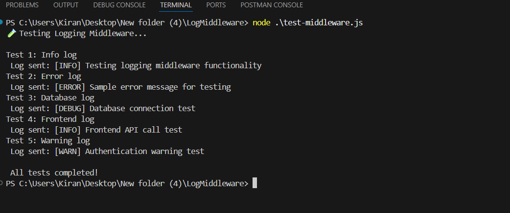
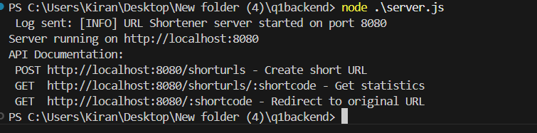
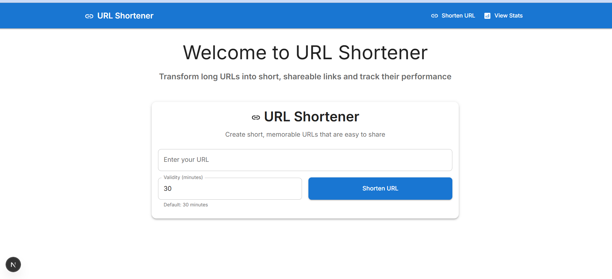
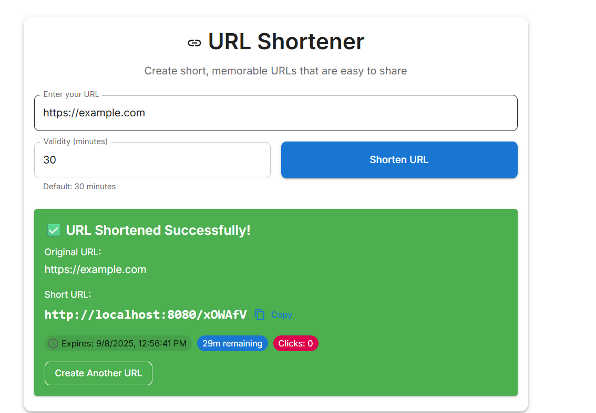
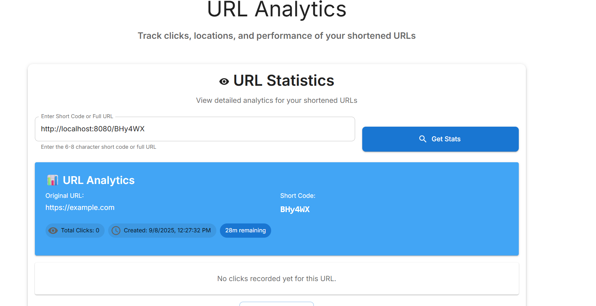

# URL Shortener Application

A full-stack URL shortener application built with **Next.js TypeScript frontend** and **Express.js backend**. Create short, memorable URLs with configurable expiration times and track detailed analytics.

## Features

- URL Shortening with custom or auto-generated shortcodes
- Configurable Expiration (1 minute to 24 hours)
- Real-time Analytics tracking clicks, user agents, IP addresses
- Responsive Design with Material-UI and Tailwind CSS
- Comprehensive Logging system
- TypeScript support for better development

## Screenshots

The screenshots folder contains all the application screenshots showing both frontend and backend functionality including registration, authentication, and URL shortening features.













my related proijects u can check my gitlab nextjs projects and simialr project that i did 
https://gitlab.com/krian13tech/qr_shorten
https://gitlab.com/krian13tech
this was my gitlab u can check my prevoius projects
## Technology Stack

**Frontend:**
- Next.js 15.5.2 with TypeScript
- Material-UI (MUI) for components
- Tailwind CSS for styling
- React Hook Form + Yup validation
- Axios for API calls

**Backend:**
- Node.js with Express.js 5.1.0
- In-memory data storage
- Custom URL validation
- Logging middleware
- CORS enabled

## Prerequisites

- Node.js (v18 or higher)
- npm (v8 or higher)
- Git

```

### Step 2: Backend Setup (Express.js)

Navigate to the backend directory and install dependencies:
```bash
cd q1backend
npm install
```

Start the backend server:
```bash
node server.js
```

The backend will start on `http://localhost:8080`

**Backend API Endpoints:**
- POST /shorturls - Create a new short URL
- GET /shorturls/:shortcode - Get URL statistics
- GET /:shortcode - Redirect to original URL
- GET / - Health check endpoint

### Step 3: Frontend Setup (Next.js TypeScript)

Open a new terminal and navigate to the frontend directory:
```bash
cd q2frontend
npm install
```

Start the development server:
```bash
npm run dev
```

The frontend will start on `http://localhost:3000`

### Step 4: Logging Middleware Setup (Optional)

To test the logging functionality:
```bash
cd LogMiddleware
npm install
node test-middleware.js
```

## Configuration

### Environment Variables

Create a `.env` file in the backend directory:
```env
PORT=8080
NODE_ENV=development
ACCESS_TOKEN=your_access_token_here
```

Create a `.env.local` file in the frontend directory:
```env
NEXT_PUBLIC_API_URL=http://localhost:8080
```

## Usage

### Creating Short URLs

1. Open your browser and go to `http://localhost:3000`
2. Enter a valid URL (must start with http:// or https://)
3. Set the validity period (1-1440 minutes, default: 30 minutes)
4. Click "Shorten URL"
5. Copy the generated short URL

### Viewing Analytics

1. Go to the "Statistics" tab
2. Enter the short code or full short URL
3. Click "Get Stats" to view detailed analytics
4. View click history, user agents, IP addresses, and timestamps

